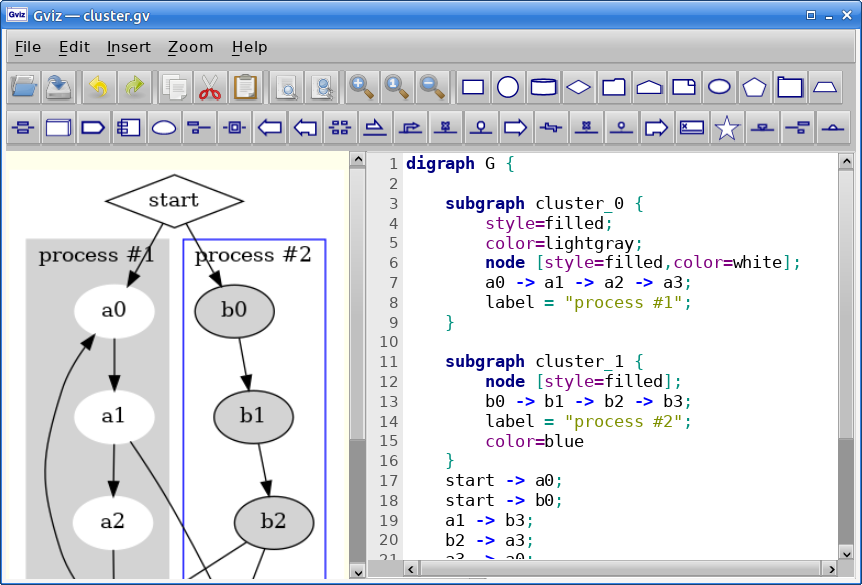

# Gviz

A GUI application for editing and viewing GraphViz diagrams.

To export to `.svg` or `.png` or to save `.gv` text in canonical format, the
graphviz `dot` command line tool must be present and in the `PATH`.

## License

GPL-3

---
